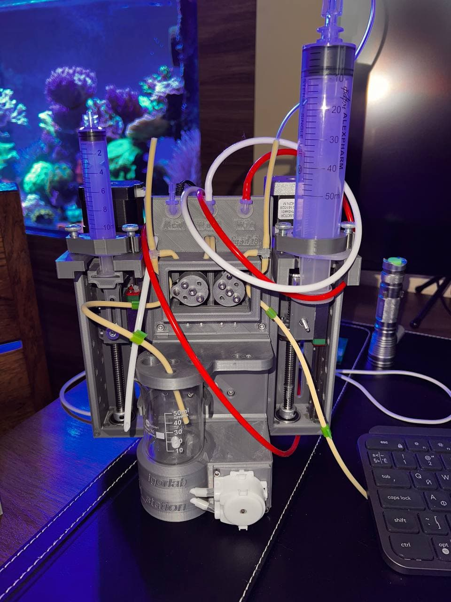
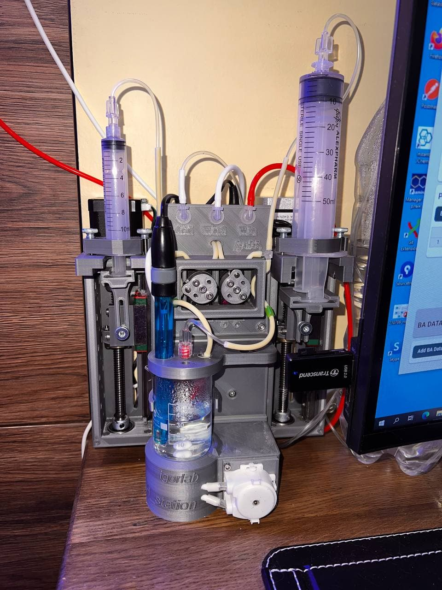
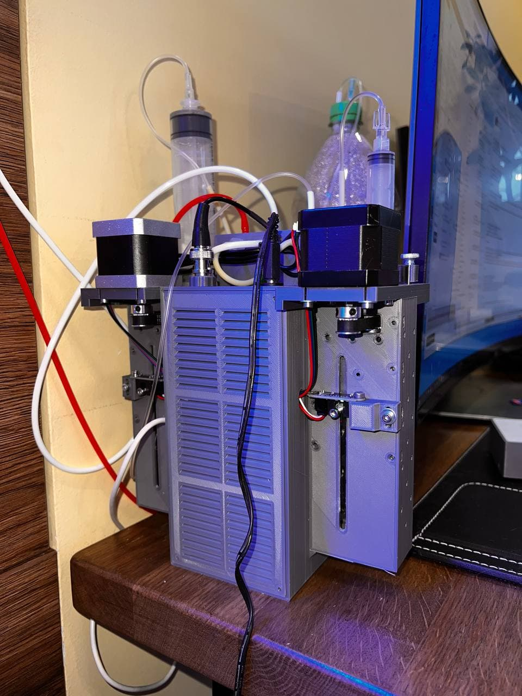
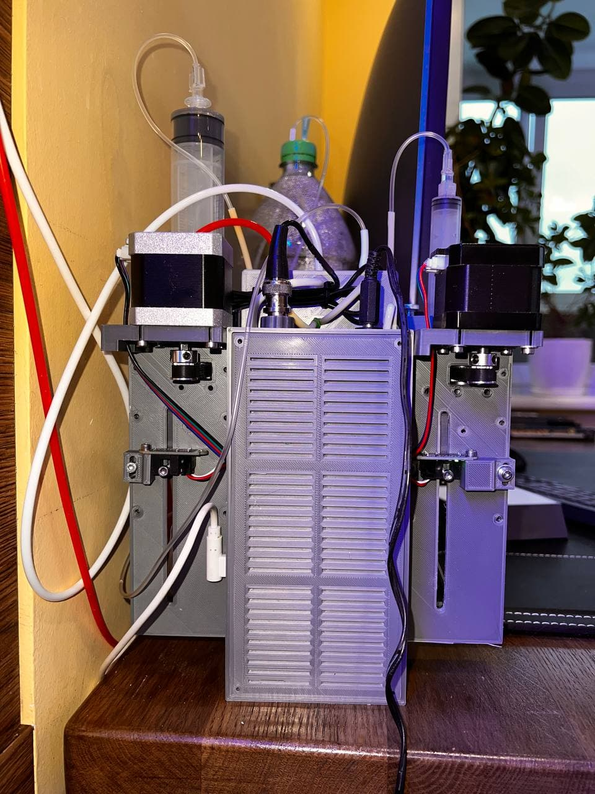

# Autosampling titrator for aquarium

[comment]: <> (![Travis CI status]&#40;https://api.travis-ci.org/witnessmenow/Universal-Arduino-Telegram-Bot.svg?branch=master&#41;)

[comment]: <> (![Travis CI status]&#40;https://api.travis-ci.org/witnessmenow/igorlab/KH_station.svg?branch=master&#41;)

Join the [Arduino Aquarium titrator Group Chat](https://t.me/+Ad4m-7L7tV1lNGNi) if you have any questions/feedback or
would just like to be kept up to date with the project progress.

## Assembling guide
## 1. Syringe pump parts

Parts should be printed:

| # |Part name,  *.stl      | Infill    | Amount | Comment |
|---- |---------------------- | --------- | -------| --------|
| 1 |_syr2_body.STL_              |     70 %  | 2 |
| 2 |_atenuator.STL_              |     80 %  | 2
| 3  |_syr2_topPL.STL_             |     80 %  | 1
| 4  |_syr2_topPL_50ml.STL_        |     80 %  | 1
| 5  |_syr2_driver_50ml.STL_       |     80 %  | 1
| 6  |_syr2_voditel.STL_           |     90 %  | 1
| 7  |_syr2_driver_50ml.STL_           |     90 %  | 1
| 8  |_syr2_driver.STL_           |     90 %  | 1
| 9  |_syr2_s_holder_50ml.STL_           |     90 %  | 1
| 10  |_syr2_s_holder.STL_           |     90 %  | 1
| 11 |_Opto_holder.STL_           |     40 %  | 1
| 12  |_Lerdge Optical Endstop MOUNT.STL_           |     40 %  | 1

Another parts:

| # |Part name     | Pcs    | Length | Comment |
|---- |---------------------- | --------- | -------| --------|
| 1 |[_T8 Lead Screw_](https://aliexpi.com/KmXX)                                                                         |    2  | 150 mm |
| 2 |[_Linear guide MGN12H_](https://aliexpi.com/KmXX)                                                                   |    2  | 125 mm
| 3  |[_GT2 Pulley 16T-5B_](https://www.aliexpress.com/item/32724156349.html?spm=a2g0s.9042311.0.0.27424c4dbSUZ1x)       |    2  | 
| 4  |[_GT2 Pulley 20T-5B_](https://www.aliexpress.com/item/32724156349.html?spm=a2g0s.9042311.0.0.27424c4dbSUZ1x)       |    2  | 
| 5  |[_GT2 Closed Loop Belt_](https://www.aliexpress.com/item/32950422029.html?spm=a2g0s.9042311.0.0.27424c4dVVutuE)    |    2  | 
| 6  |[_Stop ring 8-14-8_](https://www.aliexpress.com/item/32950422029.html?spm=a2g0s.9042311.0.0.27424c4dVVutuE)        |    2  | 
| 7  |[_LERDGE Optical Endstop_](https://www.aliexpress.com/item/32817734162.html?spm=a2g0s.9042311.0.0.27424c4d7GGfeK)  |    2  | 
| 8  |[_Bolt m3_](https://www.aliexpress.com/item/32817734162.html?spm=a2g0s.9042311.0.0.27424c4d7GGfeK)                 |    4  | 30 mm
| 8  |[_Bolt m3_](https://www.aliexpress.com/item/32817734162.html?spm=a2g0s.9042311.0.0.27424c4d7GGfeK)                 |    6  | 22 mm

>Step by step assembling
> 

