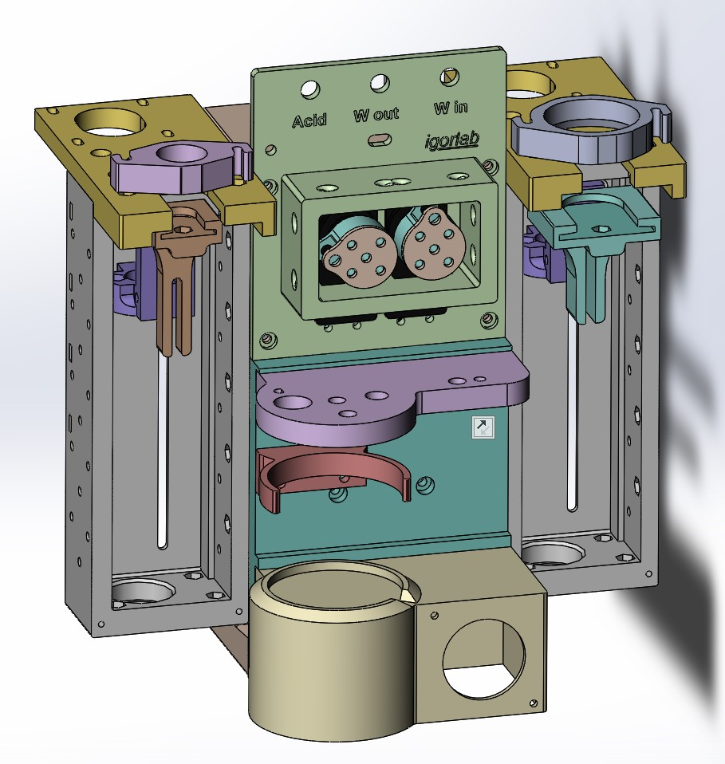
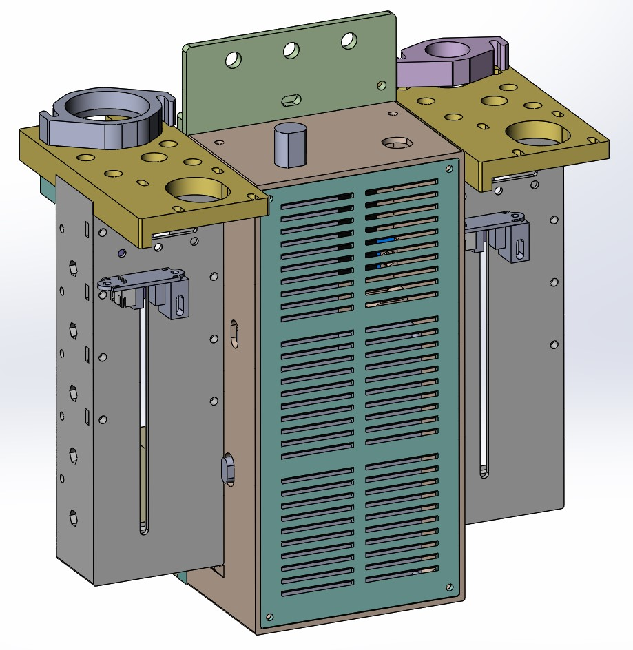
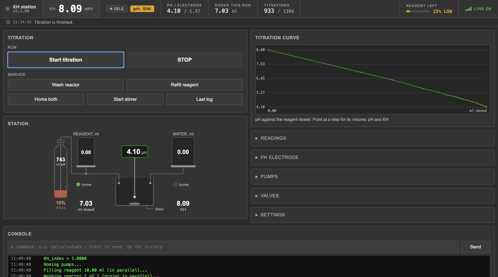
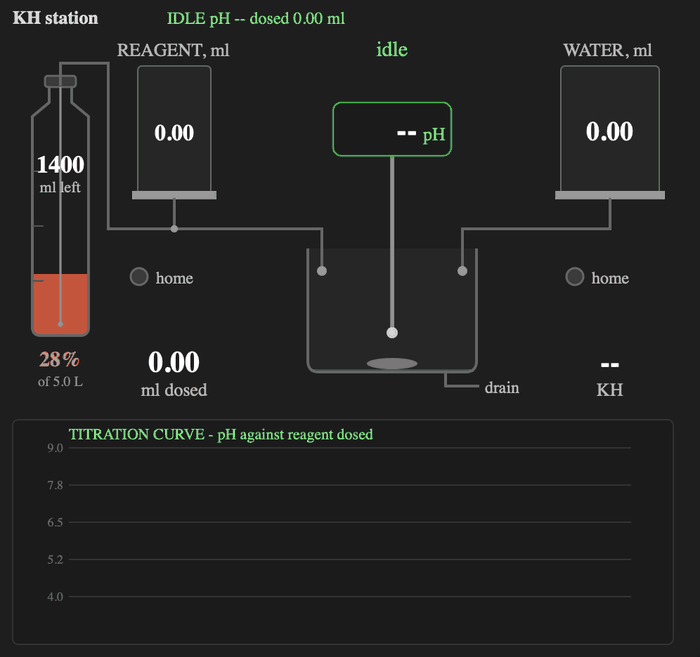

# KH station

A little machine that tests your reef tank's KH (carbonate hardness) for you —
automatically, on a schedule — and texts you the result on Telegram. It also shows a
live dashboard in your browser and can log every reading to
[labaqua.net](https://labaqua.net/).





[](https://youtu.be/T8ol2PM2Kjg)

Questions, feedback, or just want to see what other people are building? Join the
[Arduino Aquarium titrator group chat](https://t.me/+Ad4m-7L7tV1lNGNi).

---

## What it does

It runs a real titration — the same kind you'd do by hand with a syringe and a test kit
— except it does it by itself, on a timer, and tells you the number afterwards.

One run looks like this:

1. **Home** — both syringes move to their limit switches, so the machine knows exactly
   where they are before it starts.
2. **Draw reagent** — the reagent syringe pulls in 10 ml of HCl while the water side is
   busy with the next steps, so no time is wasted.
3. **Rinse** — the reactor gets flushed with tank water and drained, so nothing from the
   last test is left behind.
4. **Take a sample** — 25 ml of tank water goes into the reactor.
5. **Settle** — the stirrer runs for a bit so the electrode has time to give a steady
   reading.
6. **Dose** — acid goes in step by step, starting big (3 ml) and getting finer (down to
   0.01 ml) as the pH gets close to the endpoint. After each drop, it waits for the
   reading to actually settle instead of just waiting a fixed number of seconds.
7. **Endpoint** — dosing stops at **pH 4.10**.
8. **Wrap up** — both syringes go home, the reactor drains, and the result is sent out.

The math behind the number:

```
KH = (2804 × acid used, ml × acid concentration) / (sample size, ml / 1.026)
```

Defaults are 0.01 mol/L HCl and a 25 ml sample, both of which you can change.

If a result is more than `maxDeviation` (0.30 dKH by default) away from the last one,
the station doesn't just report it — it runs again to double-check. If two retries in a
row still don't agree, it tells you something's off instead of guessing.

---

## Repository layout

| Path | What's in it |
|---|---|
| `firmware/` | `firmware.bin` and `bin_version.txt` — what your station downloads when it updates itself |
| `PCB/` | schematics (main board and pH front end) and the parts list |
| `STL/` | every 3D-printed part: pump bodies, carriage, reactor holder, valve rotors, stirrer |
| `Assembling/` | build photos and notes |
| `docs/` | step-by-step guides — [creating your Telegram bot and finding your ID](docs/telegram-setup.md) |
| `tools/kh_loader/` | a small helper sketch for upgrading an older station (see below) |

---

## Hardware

- **ESP32** (DOIT DEVKIT V1 or similar, 4 MB flash)
- **Two syringe pumps** — one for reagent (10 ml), one for the water sample (25 ml).
  Each has its own stepper motor, a limit switch for homing, and a small servo-driven
  valve that switches between filling and injecting.
- **pH electrode**, read through an amplifier board into the ESP32's ADC
- **Magnetic stirrer**
- **Drain pump** to empty the reactor between runs

Pin map (`include/PIN_definition.h`):

| Function | GPIO | | Function | GPIO |
|---|---|---|---|---|
| Reagent EN / STEP / DIR | 13 / 12 / 23 | | Water EN / STEP / DIR | 27 / 26 / 19 |
| Reagent endstop / valve | 16 / 18 | | Water endstop / valve | 5 / 17 |
| pH input | 35 | | pH loopback for bench testing | 25 |
| Drain pump | 33 | | Stirrer | 32 |
| Buzzer | 4 | | | |

### Pump speed

The two pumps don't all move at the same speed — on purpose:

| Move | Speed | Why it's set this way |
|---|---|---|
| Dosing | 1000 Hz | This is the number that becomes your KH result, so it moves carefully |
| Filling | 1500 Hz | Also matters for accuracy, but less critical, so a bit faster |
| Homing | 3000 Hz | Just driving to a limit switch, so it can go fast |

You can change any of these later (`setdosehz_`, `setfillhz_`, `sethomehz_`) if you've
tested your build at a higher speed and trust it.

---

## Getting started

### 1. Set up the device

**Wi-Fi first.** On its first start the station opens its own Wi-Fi access point called
**AutoConnectAP**. Join it from your phone, pick your network and type its password —
the station remembers it and connects from then on. (It opens AutoConnectAP again
whenever it can't reach that network at startup — but since firmware 2.5.6 it no longer
waits there: it keeps titrating, looks for its network every minute and reconnects by
itself, so after a power cut it comes back even if the router starts slower than it.)

**Then Telegram.** You need a bot of your own and your numeric Telegram ID —
**[Setting up Telegram](docs/telegram-setup.md)** walks you through both in about five
minutes.

With those in hand, give it the rest — either on the page
`http://kh-station.local/settings` (linked at the bottom of the dashboard; it shows what
is already set), or over USB with a serial monitor at **115200 baud**,
one line at a time:

```
bottoken_<the token @BotFather gave you>
settlgrmid_<your numeric Telegram id>
ukey_<the token labaqua.net emailed you>
```

`ukey_` restarts the station, so send it last. Don't skip `settlgrmid_` — it's what
keeps strangers from being able to control your station over Telegram. If everything
went through, the bot will say "KH station started" once it restarts. Since firmware
2.5.13 that message also says **why** the station restarted — power cut, a dip in the
power supply, a crash or a command — and `lastreset` repeats it. If your station keeps
restarting on its own, that line is the thing to send when you ask for help. Bot
silent? See [If the bot stays silent](docs/telegram-setup.md#if-the-bot-stays-silent).

**Optional: a backup Wi-Fi network** (firmware 2.5.4 and newer). If the main network is
unreachable for a minute, the station joins the backup by itself and tells you in
Telegram. Set it on the `/settings` page, or with
`wifibackup_<network name>#<password>`. `wifibackup` shows which network it is on,
`wifiswitch` changes over by hand.

### 2. Calibrate the pumps

This is the step that matters most for accuracy, so it's worth doing properly before you
trust any reading.

1. In Telegram: **Calibrations** → **Calibrate pumps**
2. Put the tube over a cup on a scale and run **Run \<pump\> pump test**
3. When it beeps three times, weigh what came out
4. Not quite right? Send the real weight back with **Set real \<pump\> mass**, e.g. `24.87`
5. Repeat until it's spot on

Target: **reagent 10.00 ± 0.05 g, water 25.00 ± 0.05 g.**

### 3. Calibrate the pH electrode

The station ships with a placeholder calibration — you'll want to set your own with two
buffer solutions, 4.01 and 6.86:

1. Rinse the electrode and put it in the 4.01 buffer
2. Press **Start reading pH** (web) or send `readph` (serial), and wait for the number
   to stop moving
3. Send `calph_4.01`
4. Rinse, switch to the 6.86 buffer, and send `calph_6.86`

Don't skip the "wait for it to settle" part in step 2 — calibrating on a reading that
hasn't stabilized yet locks in a slightly wrong number, and every KH result after that
inherits the error.

---

## Web dashboard

Just open `http://<device-ip>/` — or `http://kh-station.local/` — nothing to install, no
internet connection needed.

[](UI.png?raw=1)

*Click for full size.*

A whole run, from rinse to result:



The bottle on the left is your reagent stock — the level drops as it gets used, and it
tells you how many millilitres are left. The stir bar moves while the stirrer is
running, and the two `home` lamps are the syringe limit switches: green when a syringe
is parked, dark when it is not, amber if the switch cannot make up its mind.

- **Header** — the latest KH, what the station is doing, and on the right the firmware
  version, the Wi-Fi network (orange when it's the backup) and its signal as 0–5 bars
- **Station diagram** — both syringes, the reactor, the tubing, the stirrer, plus the
  numbers you actually care about: pH, KH, ml dosed
- **Titration curve** — pH plotted against volume as it doses, so you can see the shape
  of the run; between runs it just plots pH over time
- **Console** — a live feed of what the station is doing, not a stale snapshot
- **Readings** — every stored value, including the correction index and how much
  reagent you have left
- **Pumps / Settings** — tucked away since you'll rarely need them day to day

Every button asks for confirmation before it actually moves anything.

> There's no login on the dashboard. Keep the station on a network you trust, and don't
> expose it to the internet.

---

## Command reference

These work the same way over serial, Telegram, and
`http://<device-ip>/commands?param=<command>`. Anything marked ⚠ moves hardware and
won't run while a titration is in progress.

**Titration**

| Command | What it does |
|---|---|
| `titr_1` ⚠ | Start a titration right now |
| `stoptitr` | Stop the current run; both syringes return home |
| `washreactor` ⚠ | Rinse and drain the reactor |
| `refilreagent` ⚠ | Top up the reagent line |
| `allhome` ⚠ | Send both syringes home |
| `lastkh`, `counttitr`, `lastlog` | Last result, run count, log from the last run |

**pH**

| Command | What it does |
|---|---|
| `readph` / `stopreadph` | Start / stop live reading |
| `calph_4.01`, `calph_6.86` | Save a calibration point |
| `phwait_<ms>_<eps>_<n>_<timeout>` | Tune how the station decides a reading has settled |
| `phfilter_<mea>_<est>_<q>` | Advanced: filter tuning — changes the measured pH itself |
| `phsim_1` / `phsim_0` | Use a simulated reading instead of the real electrode — until the next restart; the station always starts on the real electrode (firmware 2.5.15 and newer) |
| `phloop_1` / `phloop_0` | Bench-test mode without a probe at all (see below) |

**Settings**

| Command | Default |
|---|---|
| `maxdeviation_<dKH>` | 0.30 |
| `retitrhour_<1..24>` | 3 |
| `setwvolume_<ml>` | 25.00 |
| `setrvolume_<L>` | 5.0 (reagent stock) |
| `setdosehz_` / `setfillhz_` / `sethomehz_` | 1000 / 1500 / 3000 |
| `stirrerd_<0..255>` | 220 |
| `settings`, `getcalvalues` | Show everything that's currently stored |

**System**

`restart`, `getip`, `freeheap`, `gettime`, `checkupdate`, `updatedevice`, `sendlogs`

---

## Firmware updates

The station checks `firmware/bin_version.txt` in this repo, and if there's a newer
version, it'll offer to update from the Telegram **Update** menu. Sending
`updatedevice` downloads `firmware/firmware.bin` over a secure connection and installs
it — no cable needed.

---

## Upgrading a station that's been running for a long time

**If your station is still on firmware 2.2.x, read this before updating.**

Older firmware saved a few settings (your sample size, last result, reagent used so
far) under different internal names than the current firmware looks for. Update
straight over the air and those won't carry over — the station will quietly reset them
to factory defaults instead of telling you anything changed.

`tools/kh_loader/kh_loader.ino` fixes this for you. Flash it once from the Arduino IDE
and it will:

1. **Print out everything** currently stored, so you have a record
2. **Carry over** your old settings to where the new firmware expects them
3. **Connect to Wi-Fi and install the latest firmware**

Your pump and pH calibration are untouched either way — no need to redo those.

It's safe to run more than once: it only ever fills in a setting that's missing. If
both an old and a new copy of a setting already exist, it leaves both alone and just
shows you what it found.

What to set in the Arduino IDE first (the second one trips people up):

- **Board** → ESP32 Dev Module
- **Partition Scheme** → *Minimal SPIFFS (1.9MB APP with OTA/128KB SPIFFS)* — the
  default scheme doesn't leave enough room and the install will fail right at the end
- **Upload Speed** → 115200
- **Erase All Flash Before Sketch Upload** → *Disabled* — otherwise the upload itself
  wipes the calibration this sketch exists to keep

It connects to the Wi-Fi network your station already uses, so there is usually
nothing to type into the sketch. To use a different network, fill in `WIFI_SSID` and
`WIFI_PASS` at the top.

Already on 2.3 or newer? You can just update normally from Telegram.

---

## Building from source

```bash
pio run                 # build
pio run -t upload       # flash over USB
```

`platformio.ini` points at a specific fork of the ESP32 platform:

```ini
platform = https://github.com/pioarduino/platform-espressif32.git#55.03.311
```

That's intentional — the mainstream platform hasn't caught up to the newer Arduino
core yet, so this project uses the [pioarduino](https://github.com/pioarduino/platform-espressif32)
fork instead, pinned to an exact version so a future update can't change the build
under you.

**Upload speed needs to stay at 115200** — faster speeds don't work reliably with this
board and cable combination.

Nothing secret lives in this repository. Your Wi-Fi password, Telegram token, chat ID
and labaqua key are all stored on the device itself, set with the commands above —
never in the source code.

---

## Testing without a pH probe connected

Send `phloop_1` and the ESP32 will simulate an electrode for you: it generates a
voltage internally and reads it back, so everything downstream — filtering,
calibration, the math — runs exactly as it would with a real probe. You'll need a
jumper wire from **GPIO25 to GPIO35** for this to work; if it doesn't detect one, it'll
tell you.

It's meant for testing only and is never saved — every restart goes back to the real
electrode, so you can't accidentally leave a station running on fake readings.

---

## Built-in safety checks

- **Won't dose into a sample that looks wrong.** If the starting pH doesn't look like
  water — say, the probe isn't actually connected — it stops and tells you, instead of
  quietly reporting a KH of 0.00.
- **Won't report a run that used zero reagent.** That's never a real result.
- **Won't publish a number it doesn't trust.** If a result disagrees with the last one,
  it retries; after two disagreements in a row, it tells you rather than guessing.
- **Always returns home after a stop.** Hit `stoptitr` and both syringes go back to a
  known position — nothing is left loaded or half-moved.

---

## License

GPL-3.0. See [LICENSE](LICENSE).
