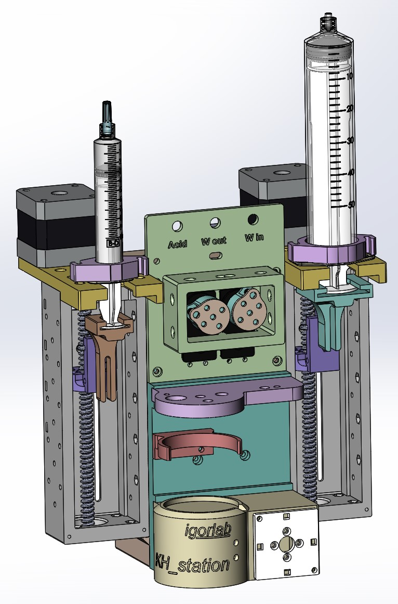

# KH station
Autosampling titrator for measuring of dKH level in saltwater aquarium

[comment]: <> (![Travis CI status]&#40;https://api.travis-ci.org/witnessmenow/igorlab/KH_station.svg?branch=master&#41;)

[comment]: <> (![Travis CI status]&#40;https://api.travis-ci.org/witnessmenow/igorlab/KH_station.svg?branch=master&#41;)

Join the [Arduino Aquarium titrator Group Chat](https://t.me/+Ad4m-7L7tV1lNGNi) if you have any questions/feedback or
would just like to be kept up to date with the project progress.

## Getting Started

To get Telegram notification you should generate new Bot and get an Access Token. Talk to [BotFather](https://telegram.me/botfather) and follow a few simple steps described [here](https://core.telegram.org/bots#botfather).

Connect device to PC throughout USB, open COM-port terminal and set up the Bot Token for your device
